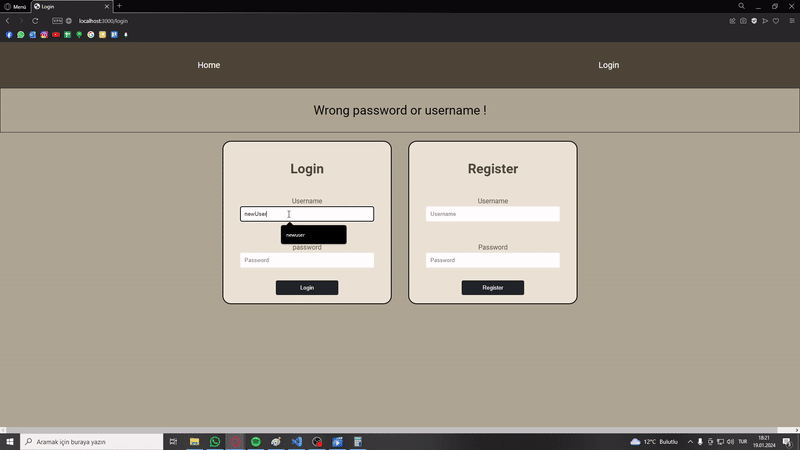

# Blog Site
This is a simple blog site created with Node.Js . I used MongoDB as database and Mongose for the conenction. Frontend  crated with EJS. Passwords are stored encyrpted using 
Bcyrpt. Authentication process is handeled using Express.Sessions. 


## Features

- `1. Authentication` : Users can register  and login/logout to the blog site .

- `2. Blog Posts` : Authenticated users can create blog posts. Each blog post includes a title, body, and author.

- `3. Comments` : Each blog post has comments.Authenticated users can add comments to blog posts. 

## Live Demo
You can acces the deployment from this link: [Simpleblogsite/onrender](https://youtu.be/4zup_JkP7mA).

# Preview 
<h4 align="center">

[For better quality video](https://youtu.be/4zup_JkP7mA)

</h4>



# How to Run
Install project dependencies:
```bash
npm install
```
Run the project:
```bash
npm start
```
Navigate to your browser and go to the specified port in `index.js` (default: 3000).
```
http://localhost:3000
```

